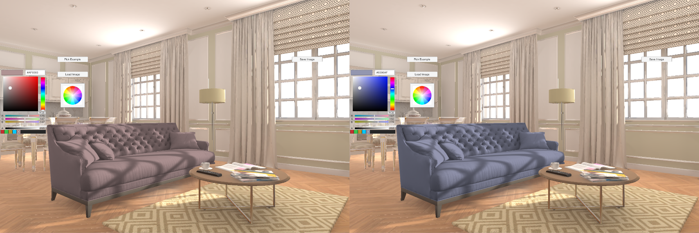
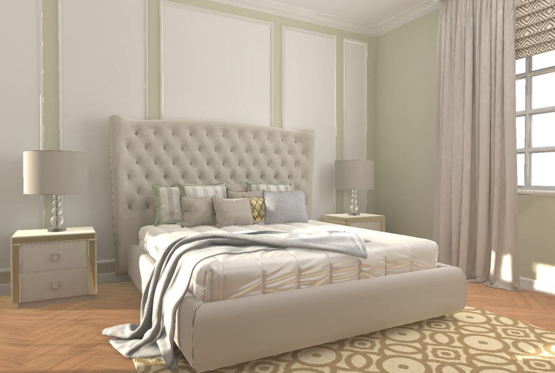
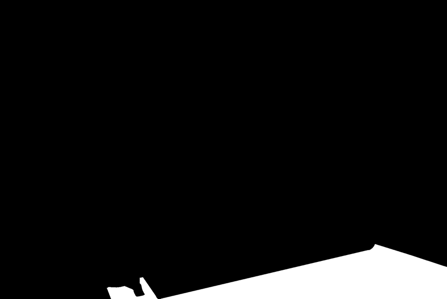

# Quick’n’dirty Unity ImageRecolor Demo V1.1

## --
## Update V1.1
A second 'recolor' shader is provided (appropriately named 'Recolor2'...). It's goal is to provide a color injection mode similar to the ones available in Photoshop. The 'BlendColor' is used. This mode only inject the color and doesn't change the Luminosity of the color.

The code is from https://mouaif.wordpress.com/2009/01/05/photoshop-math-with-glsl-shaders/

If this mode is planned to be used, a separate interaction should be offered to the user, that let him change the luminosity and/or gamme of the color, with the appropriate slider displayed onscreen.

The ratio of the loaded image is now fixed and doesn't break the UI.
## --

QnDImageRecolor is a demo of runtime system to recolor part of the image, based on a provided Black&White mask.
It's done with a shader, with only the "beauty shot" of the 3D render, and the mask from that beauty shot, where the white part of the mask indicates what part must be recolored.

## System Requirements
Unity 2018.3 or more (the script should work on lower version, but the minimum version I used was that one)

The app has been tested on OSX and Windows 10.

## Quick usage
On application start, you can either click on the **'Pick Example'** button, to automatically load an image embedded in the project, or load one of your own.
A folder with a with example is also provided in **'Example Images'**.

## Purpose
The goal of this app was to showcase a quick procedure to recolor furnitures or part of furnitures in realtime, without recalculation.
No 3D scene or 3D model is needed (and there is none in the Unity project), only pair of images.
For each render (each 'beauty shot') , an associated image mask (with the same name as the beauty shot, with '_mask' as suffix) must be provided .

Example: blabla_diffuse.png must be associated with blabla_diffuse_mask.png

Since the shader is realtime, the recoloring can also be realtime (if the recoloring would be done via CPU and pixel access in memory, that wouldn't be possible).

## How it works

### Algorithm
The shader transform the RGB image to grayscale via a simple approximation: (R+G+B)/3.
The grayscale value is then multiplied with an RGB color, only where the mask pixels are white.

### Limitations
If you need to change completely the material (and not only recolor), you need to have a different render per material.

Of course, this technique doesn't take into account proper like bounces and color bleed, like a full GI algorithm would do.

## License
The C# code of the app and the Unity project is MIT licensed : https://github.com/github-for-unity/Unity/blob/master/LICENSE